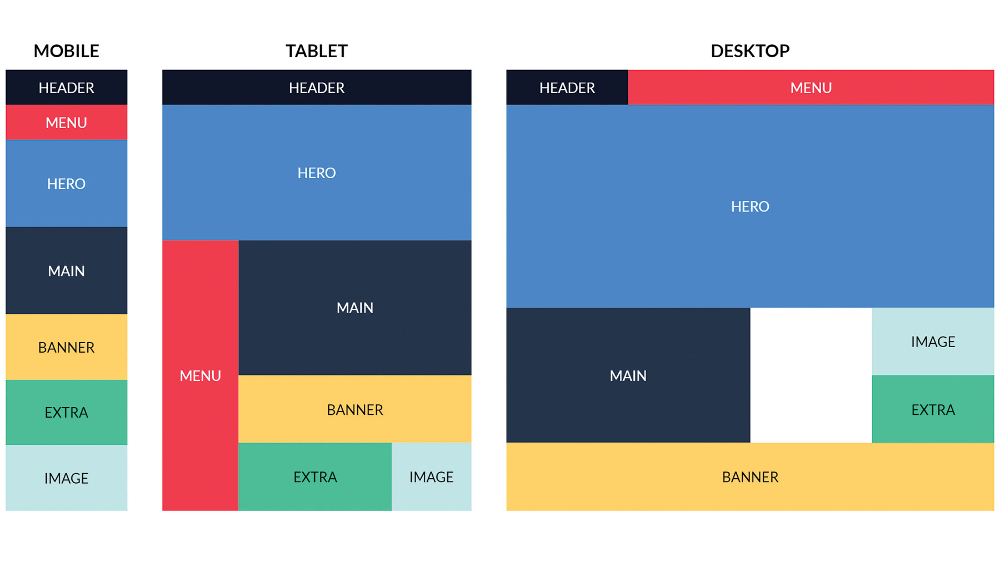

 
 

# Desafío: css_grid

## DESAFIO COMPLETADO

Completa el código que estan en el archivo styles.css; de modo que la pagina web se se adapte a estas resoluciones: mobile, tablet y desktop, como se puede ver en el siguiente modelo:

La carpeta assets no tocar por ningun motivo, de lo contrario se rompera la estructura.